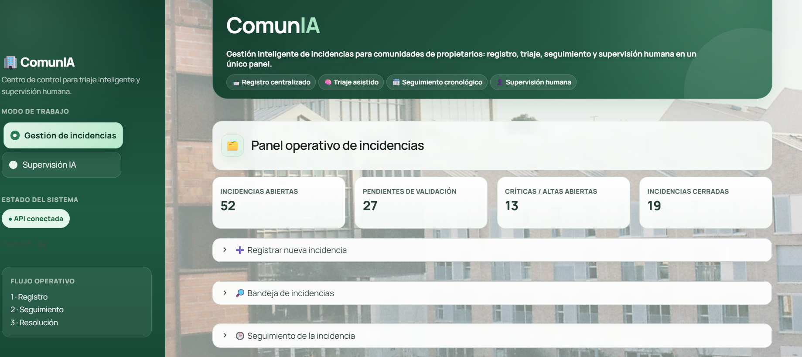
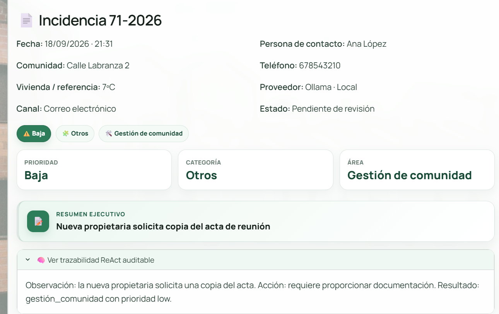
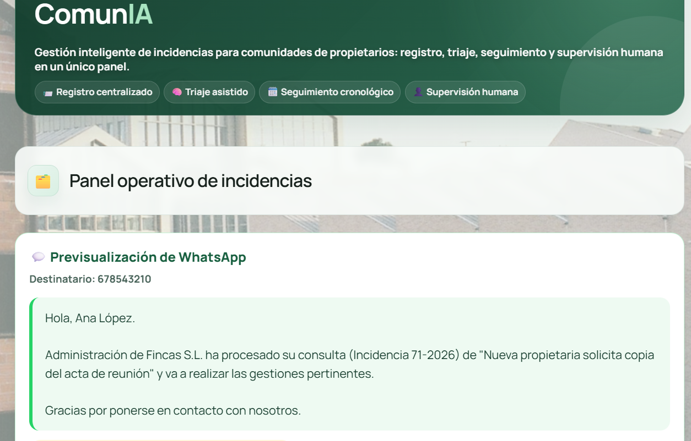
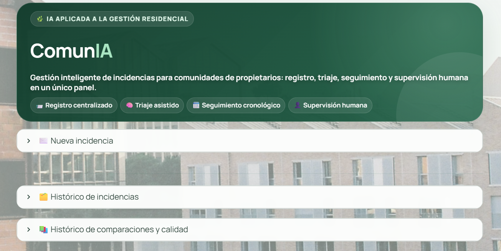
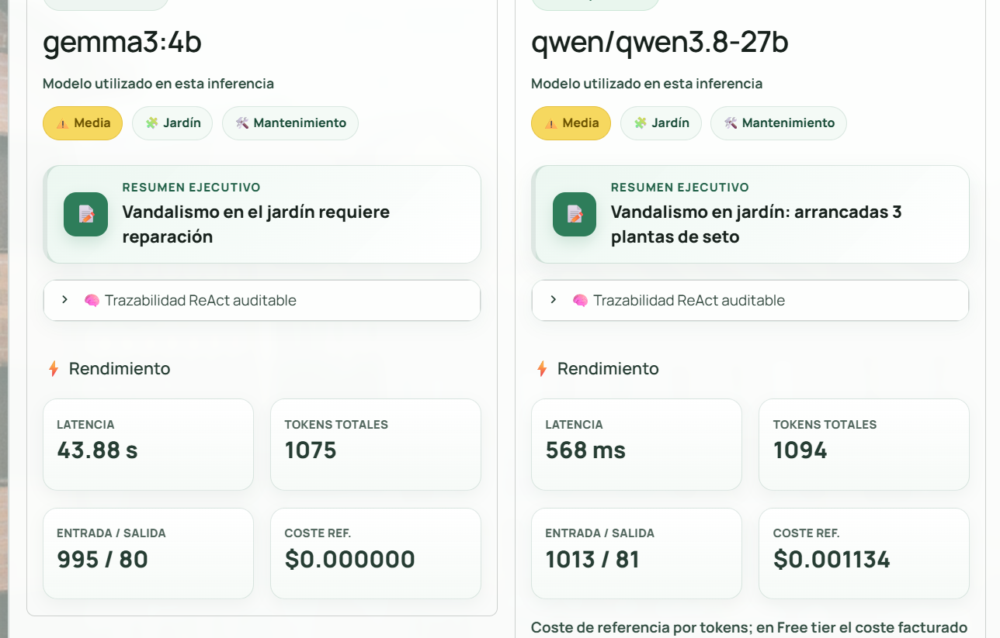
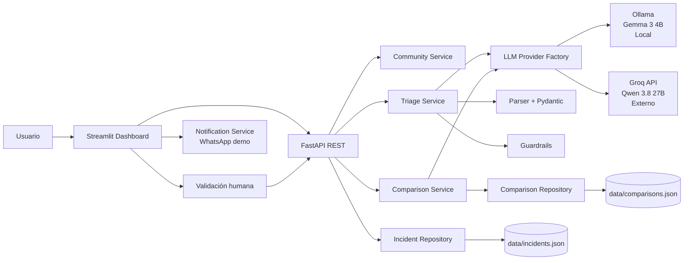

# ComunIA

> Gestión inteligente de incidencias para comunidades de propietarios: registro, triaje asistido por IA, seguimiento operativo y supervisión humana en un único panel.


**ComunIA** es un MVP de AI Engineering orientado a la gestión de comunidades de propietarios. Convierte avisos de texto libre en incidencias estructuradas, compara un modelo local y uno externo, incorpora validación humana y añade una capa operativa para que administración pueda seguir cada caso hasta su cierre.

El proyecto nace como respuesta al briefing del **Proyecto I · Módulo V: AI Engineering**, centrado en construir un motor de triaje asistido por LLM con API type-safe, arquitectura multi-proveedor, dashboard interactivo, métricas, testing y Human-in-the-loop.

---

## Qué hace ComunIA

ComunIA separa dos necesidades distintas dentro de una administración de fincas:

### Gestión de incidencias

Pensada para el trabajo diario de administración o secretaría:

- registro de nuevas incidencias;
- identificación de la comunidad y datos de contacto;
- clasificación automática por categoría, prioridad y área responsable;
- bandeja con filtros por estado, prioridad, categoría, comunidad, fecha y contacto;
- referencias amigables como `Incidencia 12-2026`;
- seguimiento cronológico de llamadas, visitas, citas y actuaciones;
- estados operativos hasta el cierre;
- previsualización de un mensaje de WhatsApp en **modo demo**, sin realizar ningún envío real.

### Supervisión IA

Pensada para supervisión y evaluación técnica:

- triaje con **Ollama / Gemma 3 4B** o **Groq / Qwen 3.8 27B**;
- comparación de ambos proveedores sobre la misma incidencia;
- validación humana de incidencias pendientes desde el histórico;
- comparación posterior desde el histórico si una incidencia todavía no ha sido comparada;
- métricas de latencia, tokens y coste estimado;
- evaluación humana de calidad;
- histórico de comparaciones y métricas acumuladas.

---

## Capturas

### Panel operativo de incidencias

Vista orientada al trabajo diario de administración: KPIs principales, acceso rápido al registro, bandeja filtrable y seguimiento de incidencias.



### Detalle de una incidencia y trazabilidad ReAct

Cada incidencia conserva su referencia amigable, datos de contacto, clasificación, resumen ejecutivo y una justificación auditable basada en **Observación → Acción → Resultado**.



### Comunicación al vecino · WhatsApp demo

ComunIA puede preparar una confirmación para la persona de contacto usando el resumen ejecutivo de la incidencia. En el MVP se mantiene en **modo demostración** y no realiza ningún envío real.



### Supervisión IA

La vista técnica agrupa el alta, los históricos y la evaluación de modelos en paneles colapsables para reducir ruido visual y separar la operación diaria de la supervisión de IA.



### Comparación multi-proveedor

La misma incidencia puede procesarse con **Ollama / Gemma 3 4B** y **Groq / Qwen 3.8 27B**, registrando clasificación, razonamiento auditable, latencia, tokens y coste de referencia.



---

## Arquitectura



### Flujo de una incidencia

```text
Aviso del usuario
      ↓
Validación de entrada con Pydantic
      ↓
Identificación de la comunidad
      ↓
LLM seleccionado: Ollama o Groq
      ↓
Salida estructurada + validación Pydantic
      ↓
Guardrails de prioridad
      ↓
Validación humana
      ↓
Gestión operativa y seguimiento cronológico
      ↓
Cierre de la incidencia
```

---

## Diseño de IA

### Salida estructurada

El modelo devuelve una clasificación validada con Pydantic que incluye:

- categoría;
- prioridad;
- resumen ejecutivo de hasta 10 palabras;
- área responsable;
- justificación auditable.

Si la respuesta del LLM no cumple el contrato esperado, la aplicación captura el error y utiliza un flujo de reparación sin detener el servicio.

### ReAct auditable

El prompt utiliza una adaptación auditable del enfoque ReAct para que la justificación visible siga una estructura breve y controlada:

```text
Observación → Acción → Resultado
```

El objetivo es aportar trazabilidad útil a la persona supervisora sin depender de texto conversacional libre.

### Few-shot y parámetros

El sistema incluye ejemplos Few-shot y configura parámetros de generación como `temperature` y `top_p` para favorecer clasificaciones estables y reproducibles.

### Control de sesgos

El prompt indica explícitamente que la prioridad debe depender del riesgo, gravedad, alcance y urgencia de la incidencia, y no de género, origen, raza, barrio u otros atributos demográficos inferidos.

---

## Human-in-the-loop

La clasificación de IA no se considera decisión final por sí sola.

Una persona supervisora puede:

- aprobar la clasificación;
- corregir categoría, prioridad, área, resumen o justificación;
- recuperar desde el histórico incidencias que hayan quedado `Pendientes de revisión`;
- validar posteriormente una comparación entre modelos;
- utilizar esa referencia humana para medir la calidad real de Ollama y Groq.

---

## Comparación de proveedores

| Característica | Ollama | Groq |
|---|---|---|
| Ejecución | Local | API externa |
| Modelo | Gemma 3 4B | Qwen 3.8 27B |
| Coste API efectivo | 0 | Free tier durante el prototipo |
| Métricas registradas | Tokens, latencia | Tokens, latencia, coste ref. |
| Salida validada | Pydantic | Pydantic |
| Calidad | Referencia humana | Referencia humana |

La comparación no asume que dos modelos que coinciden estén necesariamente en lo correcto: la calidad se calcula sobre comparaciones revisadas por una persona.

---

## Stack tecnológico

- **Python 3.12**
- **FastAPI** — API REST
- **Pydantic / pydantic-settings** — contratos type-safe y configuración
- **Streamlit** — dashboard
- **Ollama + Gemma 3 4B** — inferencia local
- **Groq + Qwen 3.8 27B** — proveedor externo
- **httpx** — comunicación HTTP
- **tenacity** — retry/backoff
- **RapidFuzz** — resolución tolerante de referencias de comunidad
- **Pytest** — tests unitarios y de API

---

## Estructura del proyecto

```text
ComunIA/
├── app/
│   ├── api/                  # Rutas FastAPI
│   ├── core/                 # Configuración, enums y excepciones
│   ├── guardrails/           # Reglas de seguridad/prioridad
│   ├── llm/                  # Proveedores Ollama y Groq
│   ├── models/               # Esquemas Pydantic
│   ├── parsers/              # Parseo y validación de respuestas
│   ├── prompts/              # Prompt de sistema + Few-shot
│   └── services/             # Triaje, comparación, repositorios, notificaciones
├── dashboard/
│   ├── app.py                # Interfaz Streamlit
│   └── assets/               # CSS y recursos visuales
├── data/
│   ├── communities.json      # Catálogo maestro de comunidades
│   ├── incidents.example.json
│   └── comparisons.example.json
├── docs/                     # Arquitectura, ética, UX y flujo operativo
├── scripts/
│   └── generate_demo_incidents.py
├── tests/
├── .env.example
├── requirements.txt
└── README.md
```

`data/incidents.json`, `data/comparisons.json` y `.env` son archivos de ejecución privados y no deben versionarse.

---

## Instalación

### 1. Clonar el repositorio

```bash
git clone https://github.com/Mary1922/ComunIA.git
cd ComunIA
```

Para trabajar con la versión de desarrollo:

```bash
git switch dev
```

### 2. Crear y activar el entorno virtual

```bash
python3 -m venv .venv
source .venv/bin/activate
python -m pip install --upgrade pip
pip install -r requirements.txt
```

### 3. Configurar variables de entorno

```bash
cp .env.example .env
```

Configura al menos:

```env
OLLAMA_BASE_URL=http://localhost:11434
OLLAMA_MODEL=gemma3:4b

GROQ_API_KEY=tu_clave_privada
GROQ_BASE_URL=https://api.groq.com/openai/v1
GROQ_MODEL=qwen/qwen3.8-27b
```

Nunca subas `.env` al repositorio.

### 4. Preparar Ollama

```bash
ollama pull gemma3:4b
```

Comprueba que Ollama está disponible en `localhost:11434`.

---

## Ejecución

### Backend

En una terminal:

```bash
source .venv/bin/activate
python -m uvicorn app.main:app --reload
```

Comprobación rápida:

```bash
curl http://127.0.0.1:8000/api/v1/health
```

### Frontend

En otra terminal:

```bash
source .venv/bin/activate
streamlit run dashboard/app.py
```

Después abre:

```text
http://localhost:8501
```

---

## Datos sintéticos para la demo

El proyecto incorpora un generador de incidencias ficticias para disponer de una bandeja suficientemente poblada durante la demostración.

```bash
python scripts/generate_demo_incidents.py --count 50
```

El script añade incidencias sintéticas sin sustituir los registros existentes y evita realizar llamadas a los LLM.

Para retirar el lote demo:

```bash
python scripts/generate_demo_incidents.py --count 50 --remove-demo
```

---

## WhatsApp: modo demostración

ComunIA puede preparar una previsualización de mensaje para la persona de contacto después de registrar una incidencia.

Ejemplo:

```text
Administración de Fincas S.L. ha procesado su consulta
(Incidencia 12-2026) de “Falta de señal de televisión comunitaria”
y va a realizar las gestiones pertinentes.
```

**No se envía ningún WhatsApp real.** La funcionalidad está desacoplada mediante `notification_service.py` para permitir una futura integración sin alterar el núcleo de triaje.

---

## API principal

| Método | Endpoint | Función |
|---|---|---|
| `GET` | `/api/v1/health` | Estado del servicio |
| `POST` | `/api/v1/triage` | Clasificar una incidencia con un proveedor |
| `POST` | `/api/v1/compare` | Comparar Ollama y Groq |
| `GET` | `/api/v1/incidents` | Consultar incidencias |
| `PATCH` | `/api/v1/incidents/{id}/review` | Aprobar o corregir clasificación |
| `GET` | `/api/v1/comparisons` | Consultar comparaciones |
| `GET` | `/api/v1/comparisons/quality` | Métricas de calidad humana acumulada |

El dashboard añade sobre estos servicios los flujos de gestión, seguimiento, validación y comparación histórica.

---

## Testing

Ejecuta:

```bash
pytest -q
```

Estado actual del MVP:

```text
35 tests passing
```

La batería cubre, entre otros aspectos:

- esquemas Pydantic;
- endpoint válido;
- salida estructuralmente incorrecta del LLM;
- guardrails de prioridad;
- matching de comunidades;
- proveedores Ollama/Groq mediante mocks;
- persistencia y revisión humana;
- comparación y métricas de calidad;
- seguimiento operativo;
- generador de datos demo;
- notificación WhatsApp en modo simulación.

---

## Robustez y privacidad

- Los datos personales de contacto se almacenan para la gestión operativa, pero no se envían al LLM para clasificar la incidencia.
- La clasificación se basa en el texto de la incidencia, no en atributos personales.
- Las salidas se validan con Pydantic.
- Los errores del proveedor se controlan sin detener el servidor.
- Groq dispone de retry/backoff ante errores transitorios y límites de uso.
- Los archivos de ejecución con datos reales permanecen fuera de Git.

---

## Cumplimiento del briefing

- [x] FastAPI
- [x] Entrada y salida type-safe con Pydantic
- [x] Proveedor local mediante Ollama
- [x] Proveedor externo mediante Groq
- [x] Selección y comparación multi-proveedor
- [x] JSON estructurado
- [x] Few-shot
- [x] ReAct auditable
- [x] `temperature` / `top_p`
- [x] Dashboard Streamlit
- [x] Human-in-the-loop
- [x] Tokens, latencia y coste estimado
- [x] Retry/backoff
- [x] Métrica de calidad con referencia humana
- [x] Tests automatizados
- [x] Control explícito de sesgos

---

## Estado del proyecto

**MVP funcional completado.**

La aplicación cubre el flujo completo de recepción, clasificación, supervisión y seguimiento de incidencias, además de las funcionalidades de evaluación técnica exigidas en el proyecto académico.

---

## Autoría

Proyecto individual desarrollado para el **Módulo V · AI Engineering**.

Repositorio: [github.com/Mary1922/ComunIA](https://github.com/Mary1922/ComunIA)
